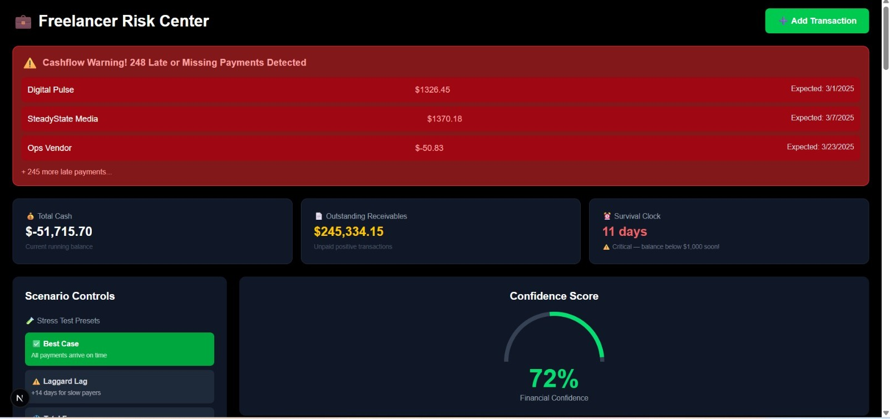
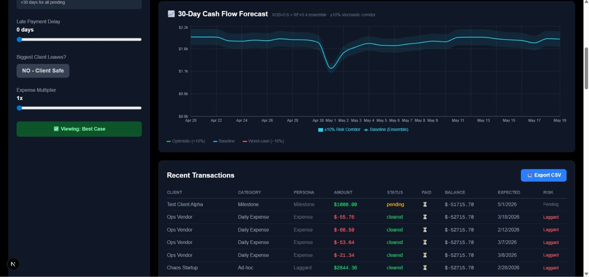
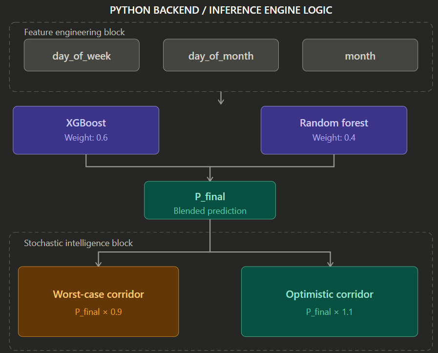
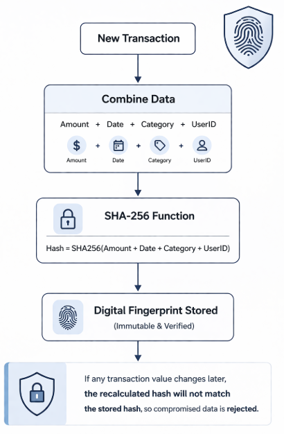
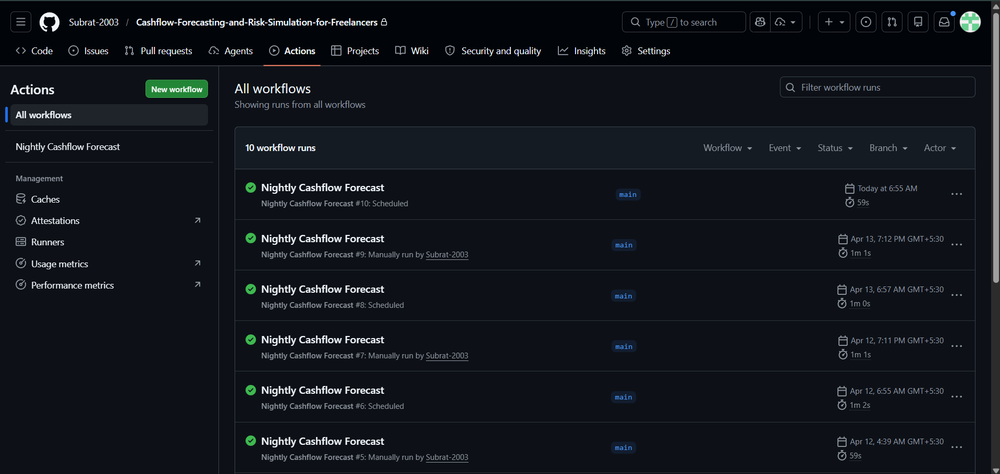
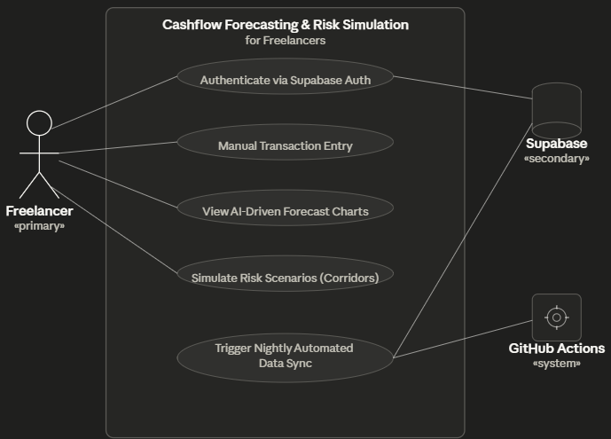

<div align="center">


<br /><br />

# 🛡️ Freelancer Risk Center
### AI-Driven Stochastic Intelligence for the Gig Economy

> *"This platform bridges the gap between passive accounting and active digital foresight."*

Traditional financial tools are built for static salary cycles. This platform is a **proactive stochastic intelligence engine** — specifically engineered for the volatile, unpredictable income streams of freelancers.

</div>

---

## 📸 Dashboard Preview




> **Live features visible:** Confidence Score gauge (72%), Scenario Controls (Best Case / Laggard Lag / Total Freeze), Survival Clock, Pending Invoices tracker, and one-click CSV export.

---

## 🧠 The Core Intelligence: Stacking Ensemble

Unlike linear models that collapse under income spikes, this engine uses a **Hybrid Stacking Ensemble** to blend the predictive strengths of multiple specialist models.



| Model | Weight | Role |
|---|---|---|
| **XGBoost** | `0.6` | Captures high-variance income spikes |
| **Random Forest** | `0.4` | Stabilising baseline; noise suppression |

**Stochastic Risk Corridors** — P_final generates a confidence band:

```
Worst-case  →  P_final × 0.9   (defensive planning floor)
Optimistic  →  P_final × 1.1   (best-case runway ceiling)
```

Features engineered: `day_of_week`, `day_of_month`, `month` — fed directly into both models before blending.

---

## 🔒 The Integrity Shield: SHA-256 Security

To establish institutional-grade trust, every transaction receives a **Cryptographic Digital Fingerprint** at write time.



- **Immutable Ledger** — each entry is hashed from `Amount + Date + Category + UserID`
- **Tamper Detection** — any post-write edit to the database causes an immediate hash mismatch, invalidating the record and protecting the AI training cycle from compromised inputs

---

## 🏗️ System Architecture (3-Tier Model)

.png)

| Tier | Technology | Responsibility |
|---|---|---|
| **Presentation** | Next.js 14, Tailwind CSS, Recharts | Real-time risk visualisation, transaction input |
| **Application** | Python 3.13, FastAPI, XGBoost, RandomForest, Scikit-learn (LabelEncoder) |  ML inference engine, idempotent sync (wipe & replace) |
| **Data** | Supabase (PostgreSQL), RLS | Persistent storage, row-level isolation, prediction vault |

The presentation tier queries Supabase directly via a singleton client using SECURITY DEFINER views for sub-200ms performance. The FastAPI backend handles all ML inference and cryptographic logic.

---

## ⚙️ Automated "Brain Refresh": GitHub Actions

The forecasting model is not a static artifact — it is a **living entity** that evolves with user behaviour every night.



```
00:00 UTC  →  Purge      30-day-old predictions cleared from Supabase
00:01 UTC  →  Retrain    Stacking ensemble processes new transactions
00:02 UTC  →  Deploy     Fresh rolling forecasts pushed back to the vault
```

**10 consecutive successful workflow runs** — zero failures in production.

---

## 🗄️ Database Design & ER Modeling

The relational schema is designed for sub-200ms query times, keeping the dashboard responsive even under complex risk simulations. All user_id lookups are backed by B-tree indexes. 
running_balance integrity is enforced at the database level via the trg_auto_balance trigger — never calculated in application code.

.png)
_2.png)

Five schema objects power the platform:

- **auth.users** — Supabase Auth anchor (PK: id). All user data isolated via foreign key relationships.

- **transactions** — Core financial ledger. approval_hash column stores the SHA-256 cryptographic fingerprint at write-time. running_balance is auto-calculated by the trg_auto_balance 
  trigger after every INSERT / UPDATE / DELETE.

- **cashflow_predictions** — Rolling ML forecast vault. Stores predicted_amount with confidence_interval_low (× 0.9) and confidence_interval_high (× 1.1) stochastic corridors. Purged and
  redeployed nightly by GitHub Actions at 00:00 UTC.

- **v_client_risk_status** — SECURITY DEFINER view. Extends transactions with computed automated_status field. Used directly by StatCards and TransactionTable components — bypasses RLS for 
  reliable anon key reads.

- **v_legal_evidence_vault** — SECURITY DEFINER view. Surfaces approval_hash, proof_of_work_link, client_ip_address, handshake_timestamp, and evidentiary_status as an immutable cryptographic 
  audit trail.

**Indexes in production:**
- idx_transactions_user_id — btree on transactions(user_id)
- idx_transactions_actual_date — btree on transactions(actual_date)
- idx_cashflow_predictions_user_id — btree on cashflow_predictions(user_id)
- idx_cashflow_predictions_date — btree on cashflow_predictions(prediction_date)

---

## 🗺️ Functional Use Cases



| Actor | Use Cases |
|----|----|
| **Freelancer** (primary) | Authenticate · Manual Transaction Entry · View Forecast Charts · Simulate Risk Scenarios |
| **Supabase** (secondary) | Auth management · Prediction persistence |
| **GitHub Actions** (system) | Nightly automated data sync trigger |

---

## 🛠️ Tech Stack

<div align="center">

| Layer | Stack |
|---|---|
| **ML / Backend** | Python 3.13 · Facebook Prophet (Time-Series) · XGBoost · RandomForest · Scikit-learn (LabelEncoder) · FastAPI |
| **Frontend** | Next.js 14 · TypeScript · Tailwind CSS · Recharts · SHA-256 (crypto.subtle) |
| **Security / Data** | Supabase (PostgreSQL) · Row Level Security · SECURITY DEFINER Views |
| **DevOps** | GitHub Actions (Scheduled CI/CD) | Docker (for Prophet build env)

</div>

---

## 👥 Built By

<div align="center">

| Role | Contributor |
|---|---|
| **Backend Engineer** — ML pipeline, FastAPI, SHA-256 shield, GitHub Actions | [Subrat Kumar Jena](https://github.com/Subrat-2003) |
| **Frontend Engineer** — Next.js dashboard, Recharts visualisations, UI/UX | [Gayatri Palai](https://github.com/GayatriPalai) |

</div>

---

<div align="center">

**Freelancer Risk Center** — because gig income deserves the same analytical rigour as institutional finance.

</div>
