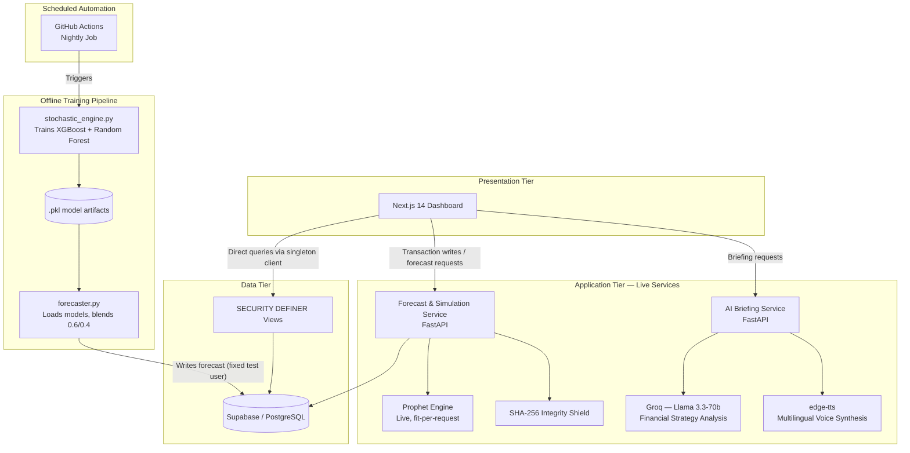
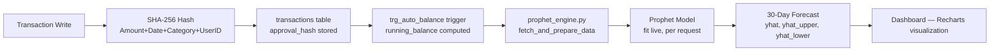
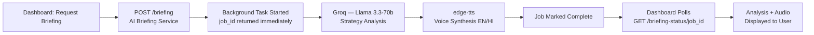
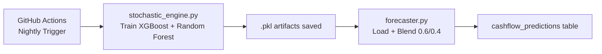

## System Architecture

**Version:** 1.2
**Status:** Final
**Last Updated:** July 2026
**Author:** Subrat Kumar Jena

---

## 1. Document Overview

This document describes the system architecture of the Cashflow Forecasting & Risk Simulation Platform ("Freelancer Risk Center") — its components, how they communicate, and how data flows through the system. It is derived entirely from the project's repository. Backend source code is treated as the authoritative source for runtime behavior; where the README's descriptive text conflicts with verified source code, source code governs. The document distinguishes the **live request/inference paths** from the **offline training pipeline** — independent flows that should not be conflated.

The platform is served by **two independent backend applications**: a Forecast & Simulation Service and an AI Briefing Service. Both are documented in this architecture.

**Status Legend used throughout this document:**
- **Implemented** — confirmed as part of the architecture, live or offline
- **Repository Module** — present in the codebase, included here for completeness; not wired into a live request path
- **Not Disclosed / Unverified** — not confirmed by repository documentation, or evidence is inconclusive

## 2. Scope

**In Scope:** Architecture of the deployed presentation, application, and data tiers; both live forecasting and AI briefing services; the offline training pipeline; database design; automated retraining schedule; security mechanisms as documented.

**Out of Scope:** API endpoint-level contracts (see `02_API_Documentation.md`), setup/installation steps (see `03_Implementation_Guide.md`), end-user operating instructions (see `04_User_Guide.md`).

## 3. High-Level Architecture

The system follows a **3-Tier Architecture**, as explicitly documented in the repository, extended with two independent application services.

The presentation tier handles transaction entry, real-time risk visualization, and AI briefing requests. The **Forecast & Simulation Service** fits a Prophet model synchronously per request. The **AI Briefing Service** generates a financial strategy analysis via Groq and a spoken narration via edge-tts, run as a background task and retrieved through a status-polling endpoint. A separate, independent **offline training pipeline** trains a Stacking Ensemble (XGBoost + Random Forest) and writes its output directly to the database on a nightly schedule, outside either live service.

## 4. System Components

| Tier | Technology | Responsibility | Status |
|---|---|---|---|
| Presentation | Next.js 14, Tailwind CSS, Recharts | Real-time risk visualization, transaction input, authentication UI | ✅ Implemented |
| Application — Forecast & Simulation Service | Python 3.13, FastAPI, Prophet | Live ML inference — fits a Prophet model per request and returns a forecast | ✅ Implemented |
| Application — AI Briefing Service | Python 3.13, FastAPI, Groq (Llama 3.3-70b), edge-tts | Generates an AI financial strategy analysis and a multilingual (English/Hindi) spoken briefing | ✅ Implemented |
| Data | Supabase (PostgreSQL), Row-Level Security | Persistent storage, row-level isolation, prediction vault | ✅ Implemented |

**Offline Training Pipeline (independent of both live services):**

| Module | Description | Status |
|---|---|---|
| `stochastic_engine.py` | Trains a Stacking Ensemble (XGBoost + Random Forest) on historical risk data, saves model artifacts | ✅ Implemented (Offline) |
| `forecaster.py` | Loads the trained artifacts, blends predictions 0.6/0.4, writes results to the prediction store on a scheduled basis | ✅ Implemented (Offline) |

**Additional Repository Modules:**

| Module | Description | Status |
|---|---|---|
| `prophet_engine.py` | Core forecasting logic for the Forecast & Simulation Service — fetches transaction data, fits a Prophet model, generates a 30-day forecast | ✅ Implemented — Live |
| `advisor.py`, `generator.py` | Present in the repository as supporting modules (Gemini-based advisory logic; synthetic data generation); not currently part of either live service's active request path |   Repository Module |

## 5. Data Flow

**Forecast & Simulation Flow (per-user, request-time):**

**AI Briefing Flow (asynchronous, background-processed):**

**Offline Training & Deployment Pipeline (scheduled, independent of both live services):**

Documented result: 10 consecutive successful GitHub Actions workflow runs, zero production failures (as stated in repository README at time of writing). This pipeline is architecturally separate from the live forecast a user sees on the dashboard, which is generated by the Prophet-based Forecast & Simulation Service.

## 6. Technology Stack

| Layer | Stack |
|---|---|
| Forecast & Simulation Service | Python 3.13, FastAPI, Prophet |
| AI Briefing Service | Python 3.13, FastAPI, Groq (Llama 3.3-70b), edge-tts |
| Offline Training | XGBoost, Random Forest, Scikit-learn, joblib |
| Frontend | Next.js 14, TypeScript, Tailwind CSS, Recharts, SHA-256 (crypto.subtle) |
| Security / Data | Supabase (PostgreSQL, Auth), Row-Level Security, SECURITY DEFINER Views |
| DevOps | GitHub Actions (Scheduled CI/CD) |

Repository dependencies additionally list Google Generative AI (Gemini), corresponding to `advisor.py` (Section 4).

## 7. Deployment Architecture

| Component | Deployment | Status |
|---|---|---|
| Frontend | Vercel — live at `cashflow-forecasting-and-risk-simul.vercel.app` | ✅ Implemented |
| AI Briefing Service | Render (Singapore region), confirmed via service configuration referenced in source and the live endpoint the frontend calls | ✅ Implemented |
| Forecast & Simulation Service | Reached by the frontend through a Vercel rewrite proxy (`/api/:path*`); the underlying host behind that proxy is not disclosed in the repository | ⚠️ Not Disclosed |
| Database | Supabase (PostgreSQL) | ✅ Implemented |
| CI/CD | GitHub Actions — scheduled nightly job (offline training pipeline) | ✅ Implemented |
| Environment variables | Confirmed: `NEXT_PUBLIC_SUPABASE_URL`, `NEXT_PUBLIC_SUPABASE_KEY` (frontend); `SUPABASE_URL`, `SUPABASE_KEY` (GitHub Actions); a Groq API key variable (AI Briefing Service) | ✅ Implemented (partially disclosed) |

## 8. Security Considerations

| Mechanism | Description | Status |
|---|---|---|
| SHA-256 Integrity Shield | Every transaction hashed at write time from `Amount + Date + Category + UserID`; any post-write edit causes a hash mismatch, invalidating the record | ✅ Implemented |
| Row-Level Security (RLS) | Enforces row-level data isolation per user in Supabase | ✅ Implemented |
| SECURITY DEFINER Views | `v_client_risk_status` and `v_legal_evidence_vault` intentionally bypass RLS for specific reliable anon-key reads — a documented design tradeoff | ✅ Implemented |
| Authentication | Supabase Auth (`auth.users`) handles user login on the frontend; neither backend service performs its own server-side authentication check on incoming requests | ✅ Implemented (frontend-managed) |
| CORS Policy | Both backend services accept requests from any origin (`allow_origins=["*"]`) | ✅ Implemented (permissive) |

## 9. Constraints

- The offline Stacking Ensemble pipeline (`stochastic_engine.py` → `forecaster.py`) runs on a nightly schedule and writes to a fixed evaluation record, separate from the live per-user Prophet forecast
- The AI Briefing Service tracks background jobs in memory; job state does not persist across a service restart
- One live route (`/simulate`) is registered twice in source with identical logic — a minor code duplication with no functional impact
- The GitHub Actions workflow file is duplicated in two locations in the repository
- The Forecast & Simulation Service's hosting platform is not documented in the repository; it is reachable via a frontend-configured proxy whose target is not disclosed
- Backend authentication is currently handled entirely at the frontend layer (Supabase Auth); neither FastAPI service independently verifies request identity

## 10. Assumptions

This document describes only what is explicitly present in the repository's source code, README, and referenced architecture assets. No component, data flow, or deployment detail has been inferred from filenames or folder structure alone. Backend source code was treated as authoritative over README narrative text; where the two conflicted, this document reflects the source code.
