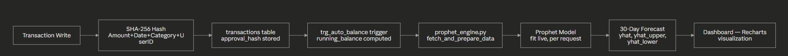
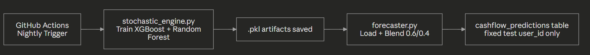

**System Architecture**

**Version:** 1.0 
**Last Updated:** July 2026 
**Author:** Subrat Kumar Jena

**1. Document Overview**

This document describes the system architecture of the Cashflow Forecasting & Risk Simulation Platform ("Freelancer Risk Center") ; its components, how they communicate, and how data flows through the system. It is derived entirely from the project's repository. **Backend source code is treated as the authoritative source for runtime behavior; where the README's descriptive text conflicts with verified source code, source code governs.** The document explicitly distinguishes the **live request/inference path** from the **offline training pipeline**; these are two independent flows that should not be conflated.

Where a component's presence in the codebase is confirmed but its integration into the live production flow is not described in repository documentation, this document records it as a **Repository Module** rather than asserting a production role.

**Status Legend used throughout this document:**

- **Implemented** — confirmed as part of the architecture, live or offline
- **Repository Module** — present in the codebase, included here for completeness; not wired into a live request path
- **Not Disclosed / Unverified** — not confirmed by repository documentation, or evidence is inconclusive

**2. Scope**

**In Scope:** Architecture of the deployed presentation, application, and data tiers; the live production forecasting flow; the offline training pipeline; database design; automated retraining schedule; security mechanisms as documented.

**Out of Scope:** API endpoint-level contracts (see 02\_API\_Documentation.md), setup/installation steps (see 03\_Implementation\_Guide.md), end-user operating instructions (see 04\_User\_Guide.md).

**3. High-Level Architecture**\
The system follows a **3-Tier Architecture**, as explicitly documented in the repository.

.png)

The presentation tier handles transaction entry and real-time risk visualization, querying Supabase directly through a singleton client. The application tier's **live request path** fits a Prophet model synchronously per API call; it does not use pretrained artifacts. A separate, independent **offline training pipeline** trains a Stacking Ensemble (XGBoost + Random Forest) and writes its output directly to the database on a schedule, outside the live request/response cycle.

**4. System Components**

|**Tier**|**Technology**|**Responsibility**|**Status**|
| :- | :- | :- | :- |
|Presentation|Next.js 14, Tailwind CSS, Recharts|Real-time risk visualization, transaction input|Implemented|
|Application (Live)|Python 3.13, FastAPI, Prophet|Live ML inference — fits a Prophet model per request and returns a forecast|Implemented|
|Data|Supabase (PostgreSQL), Row-Level Security|Persistent storage, row-level isolation, prediction vault|Implemented|

**Offline Training Pipeline (verified, independent of live request path):**

|**Module**|**Description**|**Status**|
| :- | :- | :- |
|stochastic\_engine.py|Standalone script; fetches data from the v\_client\_risk\_status view, trains XGBoost + Random Forest "specialists," saves .pkl artifacts|Implemented (Offline)|
|forecaster.py|Standalone script; loads the .pkl artifacts, blends predictions 0.6 XGBoost / 0.4 Random Forest, writes results to cashflow\_predictions for a single fixed test user\_id|Implemented (Offline)|

**Additional Repository Modules:**

|**Module**|**Description**|**Status**|
| :- | :- | :- |
|prophet\_engine.py|Fetches user transaction data, fits a Prophet model live, generates a 30-day forecast — imported and called directly by both live routes in main.py|Implemented — Live Request Path|
|advisor.py|Gemini-based ("gemini-2.5-flash") financial advisor logic; imported in main.py (get\_survival\_plan) but not called by any verified route|Repository Module — Imported, Not Wired to an Endpoint|
|generator.py|Synthetic transaction history generator; imported in main.py (upload\_to\_supabase) but not called by any verified route|Repository Module — Imported, Not Wired to an Endpoint|

**5. Data Flow**

**Live Production Prediction Flow (per-user, request-time):**

**Offline Training & Deployment Pipeline (scheduled, independent of the live path):**

**Note:** this nightly pipeline writes predictions for one hardcoded test user, not per real platform user, it is architecturally separate from the live Prophet-based forecast a real user sees via the dashboard.

**6. Technology Stack**

|**Layer**|**Stack**|
| :- | :- |
|Live Inference|Python 3.13, FastAPI, Prophet|
|Offline Training|XGBoost, Random Forest, Scikit-learn (LabelEncoder), joblib|
|Frontend|Next.js 14, TypeScript, Tailwind CSS, Recharts, SHA-256 (crypto.subtle)|
|Security / Data|Supabase (PostgreSQL), Row-Level Security, SECURITY DEFINER Views|
|DevOps|GitHub Actions (Scheduled CI/CD)|

Repository tags reference Facebook Prophet and Monte Carlo simulation. Prophet is verified as the live inference engine (Section 4). No stochastic/random-sampling Monte Carlo process was found in the live request path; the /simulate route applies a fixed scenario multiplier plus a small uniform random noise factor, which is distinct from a true Monte Carlo simulation.

**7. Deployment Architecture**

|**Component**|**Deployment**|**Status**|
| :- | :- | :- |
|Frontend|Vercel — live at cashflow-forecasting-and-risk-simul.vercel.app|Implemented|
|Backend (FastAPI) hosting platform|Render — Production deployment serving the FastAPI API consumed by the frontend application|Implemented|
|Database|Supabase (PostgreSQL)|Implemented|
|CI/CD|GitHub Actions — scheduled nightly job (offline training pipeline)|Implemented|
|Environment variables|Not enumerated in repository documentation|Not Disclosed|

**8. Security Considerations**

|**Mechanism**|**Description**|**Status**|
| :- | :- | :- |
|SHA-256 Integrity Shield|Every transaction hashed at write time from Amount + Date + Category + UserID; any post-write edit causes a hash mismatch, invalidating the record|Implemented|
|Row-Level Security (RLS)|Enforces row-level data isolation per user in Supabase|Implemented|
|SECURITY DEFINER Views|v\_client\_risk\_status and v\_legal\_evidence\_vault intentionally bypass RLS for specific reliable anon-key reads — a documented design tradeoff, not an oversight|Implemented|
|Auth|Supabase Auth (auth.users) as the identity anchor on the frontend; all user data isolated via foreign key relationships|Implemented|
|CORS Policy|FastAPI backend sets allow\_origins=["\*"] — permissive, accepts requests from any origin|Implemented (permissive — verified)|
|Backend-Side Authentication|No authentication dependency or token check is present on any FastAPI route in main.py; identity/session handling occurs client-side via Supabase only|Implemented (verified gap — no server-side enforcement)|

**9. Constraints**

- Backend hosting platform and environment variable configuration are not documented in the repository
- Prophet is the verified live inference engine; the Stacking Ensemble (XGBoost + Random Forest) operates only in the offline training pipeline and does not serve live user requests
- The offline training pipeline (stochastic\_engine.py → forecaster.py) writes forecasts for a single hardcoded test user\_id, not per real user
- advisor.py and generator.py are imported in main.py but not called by any verified route; their functionality is not currently exposed via the API
- The frontend (useForecast.ts) calls an external URL (prophet-ai-backend.vercel.app) that does not correspond to any backend deployment documented in this repository; on request failure, it silently substitutes hardcoded mock data client-side rather than surfacing an error
- The FastAPI backend has no server-side authentication check and a fully permissive CORS policy
- The "Stochastic Risk Corridors" applied in /simulate are a fixed multiplier plus small uniform random noise, not a true Monte Carlo (repeated random sampling) process
- Architecture reflects the state of the repository's main branch source code at time of writing

**10. Assumptions**

This document describes only what is explicitly present in the repository's source code, README, and referenced architecture assets. No component, data flow, or deployment detail has been inferred from filenames or folder structure alone. Per direct instruction, backend source code was treated as authoritative over README narrative text; where the two conflicted, this document was corrected to match the source code.

